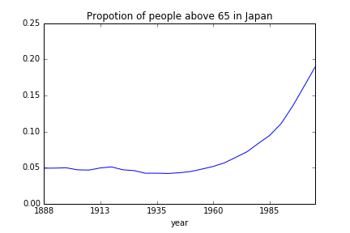
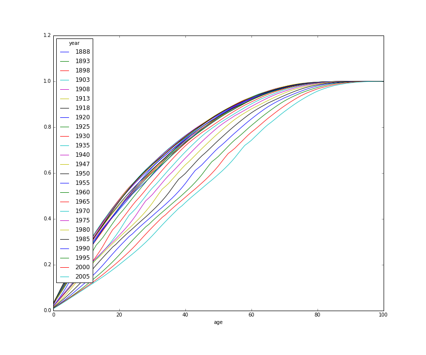

# Visual Presentation to the Decline of the Japanese Population with Python

## Objective
Visualise the structure change in the Japanese population 

## Python Dependencies
- pandas
- numpy
- matplot

## Script Logistics
The original data came from [Japan Statistics Bureau](www.stat.go.jp/english)). Data was processed and initial cleaning was done and saved to 'jp.csv'. They are then segregated by gender. Population structure with percentage for individual age/age group at the census is constructed afterwards. 

## Results
Here is the proportion of population aged over 65.

Highest reproduction rate years:
In term of the mode, the newborns was amongst the largest age group until 1950. The mode then gets higher and higher since 1955.

Cumulative Probability Distribution of population for each year

This is the plot of cumulative proportion of population against the age it is clear that the entire curve continues to shift downward indicating that the population is aging. The trend start to be noticeable from the plot since 1965.

## TODOs(maybe)
- generate kernel density function rather than slice them into age groups
- reduce the number of years in the graph as number of color in the figure is limited
